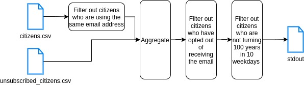

# Llamaland

Llamaland is a new country. It is a monarchy with King Tom I as its head.
When a citizen of Llamaland turns 100 years old the King would like to send them a personal email. He would like to be notified who should be sent an
email at least five weekdays in advance (the King never works weekends).  If there are "a lot" of people turning 100 years old on a particular day (a term
we now understand to mean more than 20 people) the King would like 10 weekdays notice.
The civil servants have a file which is updated every year.  It contains the names, dates of birth and email addresses of every citizen.  An extract is below:

```csv
Brown,Bobby,10-11-1950,bobby.brown@ilovellamaland.com
O'Rourke,Betsy,28-02-1900,betsy@heyitsme.com
Von Tappo,Alfredo,01-01-1920,alfie@vontappo.llama.land  
```

Some citizens do not support the monarchy and have opted out of receiving the mail. Their email address appears in another file. An extract of the file is
below:

```csv
betsy@heyitsme.com
randomperson@llama.land 
```

An e-mail from the King is extremely valued in Llamaland. To prevent abuse each citizen should have a unique email address.  Unfortunately the IT
system to capture citizen's details was built by the King's son.  It lacks a duplicate check on the e-mail address.  Rather than tackle this problem at the
source, the King's Courtiers have suggested duplicate addresses should be filtered out, such that no-one using a duplicate mail should receive an e-mail
from the King.
Your task is to write a simple program that the King‘s chief of staff will execute every day. The output should be a list of people the King should prepare an
e-mail for.

## Assumptions

- Even though the King never works during weekends, king's chief of staff does. 
King's chief of staff will print the lists (Saturday and Sunday) of people he got during the weekend and gave them to the king on Monday.


- The king would like to be notified <strong>at least</strong> 5 weekdays in advance when a citizen is turning 100 years old. 
However, when there are more than 20 peoples turning 100 years old at the same time, he would like to be notified 10 weekdays in advance.
Based on the first assumption, we can merge both cases so that the king is notified 14 <strong>days</strong> in advance that is 10 <strong>weekdays</strong> in advance. 


- The program reads the files located at the path specified by the flags -c or -u:
  - -c specify the file containing citizens data
  - -u specify the file containing emails of unsubscribed citizens
  

- A citizen must have a first name, last name, date of birth and a valid email address

### Requirements

- Java Development Kit 8
- Maven
- Docker (optional)

## Getting Started

```bash
$ git clone https://github.com/FlorianLehmann/Llamaland.git
$ cd Llamaland
```

### How to run the application?


```bash
$ mvn clean package
$ mvn exec:java
```

or

```bash
$ docker build . -t llamaland
$ docker run --rm llamaland
```

Note: The timezone is set to UTC in the docker container.

### How to run the tests?

```bash
$ mvn clean test
```

### How to build the application?

```bash
$ mvn clean package
```

## Architecture

### Data flow diagram

